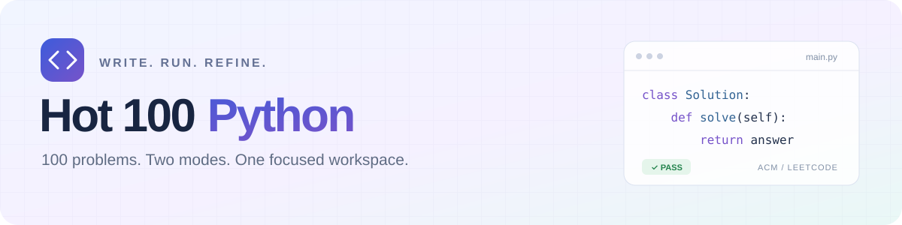
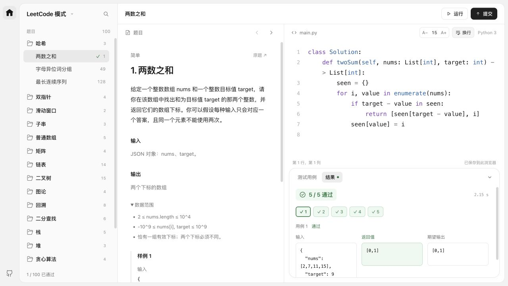

<p align="center">
  
</p>

<p align="center"><strong>支持 ACM 与 LeetCode 双模式的 Python Hot 100 在线刷题网站，打开浏览器即可写题、调试与判题。</strong></p>

<p align="center">
  <a href="https://github.com/Tianchenggg/hot100-python/actions/workflows/tests.yml"></a>
  <a href="LICENSE"></a>
  <a href="https://github.com/Tianchenggg/hot100-python/commits/main"></a>
  <a href="https://github.com/Tianchenggg/hot100-python/stargazers"></a>
</p>

<p align="center">
  
  
  
  <a href="https://pyodide.org/"></a>
  <a href="https://hot100-python.htcafasfadf.chatgpt.site"></a>
</p>

<p align="center">
  <a href="https://hot100-python.htcafasfadf.chatgpt.site"><strong>开始刷题 ↗</strong></a> ·
  <a href="#功能">功能</a> ·
  <a href="#记录保存">记录保存</a> ·
  <a href="docs/problem-audit.md">题库核查</a> ·
  <a href="docs/judge-audit.md">判题说明</a> ·
  <a href="https://github.com/Tianchenggg/hot100-python/issues">反馈问题</a>
</p>

[](https://hot100-python.htcafasfadf.chatgpt.site)

## 功能

| 📂 按知识点练习 | ⌨️ 专注写题 | 🧪 运行与调试 |
| --- | --- | --- |
| 100 道题，17 个可折叠目录<br>支持题号、标题、知识点搜索 | Python 语法高亮<br>LeetCode 模式支持字号与自动换行 | 自定义输入、输出对比<br>报错定位、停止运行 |
| **🔀 两种作答方式** | **↔️ 自由调整布局** | **💾 自动保存** |
| ACM 标准输入输出<br>LeetCode 函数与类模板 | 拖动调整目录、题面和代码区<br>双击恢复默认宽度 | 代码与通过进度保存在浏览器<br>两种模式分别保存 |

只在点击 **运行** 或 **提交** 时执行代码，输入过程中不会编译或判题。

## 开始使用

打开 **[在线网站](https://hot100-python.htcafasfadf.chatgpt.site)**，选择题目和模式，写代码后运行或提交。无需安装 Python，也不需要让自己的电脑常驻运行网站。

| | ACM 模式 | LeetCode 模式 |
| --- | --- | --- |
| 编写方式 | 完整 Python 程序 | `Solution` 方法或指定类 |
| 输入 | 按题面读取标准输入 | 按模板接收参数，测试区使用 JSON |
| 判定对象 | 标准输出 | 返回值或指定的原地修改结果 |
| 调试输出 | 会影响答案比较 | `print` 输出单独展示 |

## 判题与性能

Python 通过 Pyodide 在访问者的浏览器里执行。首次运行需要加载运行环境；提交使用有限并行，每个用例仍使用独立的 Python 环境。已执行的环境会销毁，下一次可使用提前准备好的干净环境。

- **比较符合题意**：区分精确整数、浮点容差、无序集合、多种合法答案，以及链表和树的节点语义。
- **执行有边界**：单个用例限时 5 秒，输出上限 64 KiB，支持主动停止。
- **核查可追溯**：[题库核查记录](docs/problem-audit.md) · [判题回归与限制](docs/judge-audit.md) · [性能实测](docs/performance.md)。

本项目是独立练习判题器，测试集不等同于 LeetCode 官方隐藏测试集；通过站内用例不代表所有输入都正确。浏览器判题也不用于可信比赛成绩。时间、空间复杂度要求需要结合代码分析。

## 记录保存

**关闭网页后，在同一浏览器、同一网站地址重新打开，可以继续之前的练习。**

| 自动保留 | 保存范围 |
| --- | --- |
| 每道题最新代码、自定义输入与期望输出 | ACM、LeetCode 分开保存 |
| 已通过题目、上次打开的题目与模式 | 当前浏览器 |
| 展开的知识点目录、面板宽度、代码字号与换行设置 | 当前浏览器 |

使用浏览器本地存储，不上传代码，也不跨设备同步。清除网站数据、更换浏览器或结束无痕会话可能丢失记录。目前保留最新代码和通过状态，**不保留每次提交的历史版本、结果或耗时**。

<details>
<summary><strong>开发与验证</strong></summary>

前端使用原生 JavaScript、CodeMirror 5 和 Pyodide 0.27.7。`dist/` 可直接部署，线上由 ChatGPT Sites 托管。

```sh
git clone https://github.com/Tianchenggg/hot100-python.git
cd hot100-python
npm ci
npm run check
npm test
python3 -m http.server 8000 --directory dist
```

打开 `http://localhost:8000`。测试通过 GitHub Actions 持续运行。

| 路径 | 内容 |
| --- | --- |
| `dist/app.js` · `dist/layout.js` | 页面交互、布局、本地保存 |
| `dist/runner.js` · `dist/python-worker.js` | Python 执行、并行调度、输入输出 |
| `dist/checker.js` · `dist/leetcode.js` | 答案比较、函数调用与数据结构转换 |
| `dist/data/` | 题面、模板、两种模式的测试数据 |
| `scripts/` | 数据验证与判题回归测试 |

`.openai/hosting.json` 记录当前 Sites 项目；部署为自己的 Site 时使用自己的项目标识。

</details>

## 来源与许可

题库、测试数据、模式元数据与部分驱动逻辑改编自 [Hubert-hwk/hot100-judge](https://github.com/Hubert-hwk/hot100-judge)，保留 [MIT 许可与版权声明](LICENSE)。官方题意来源为 [LeetCode 热题 100](https://leetcode.cn/studyplan/top-100-liked/)，完整说明见 [SOURCES.md](SOURCES.md)。

感谢 [CodeMirror](https://codemirror.net/5/) 和 [Pyodide](https://pyodide.org/)。本项目与 LeetCode、OpenAI 及上游作者不存在官方隶属关系。
